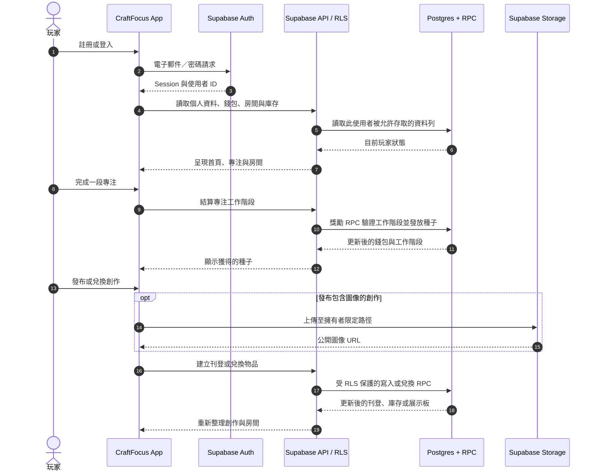

# CraftFocus

  

[English README](./README.md)

CraftFocus 是一個溫馨的專注與社交創作應用程式：投入受保護的專注時間，即可獲得種子、房間擺飾、自訂收藏品，並造訪朋友的房間。

同一套 Expo React Native 與 TypeScript 程式碼可在 **iOS、Android 和 Web** 執行。


## 玩家指南

CraftFocus 的主要循環如下：

1. 開始一段專注計時。
2. 持續停留在專注畫面，直到計時結束。
3. 獲得種子。
4. 兌換官方房間物品或玩家製作的像素創作。
5. 佈置房間和 5×5 收藏展示板。
6. 造訪朋友並與其創作互動。

登入畫面提供這個循環的輕量動畫預覽，讓新玩家可在登入前理解玩法。

## 功能一覽

- 進行 `25 / 45 / 60` 分鐘專注，並獲得種子。
- 使用者離開專注頁面、瀏覽器分頁或 App 前景時，自動停止專注。
- 使用種子兌換官方收藏物品。
- 上傳自訂創作刊登，並產生像素預覽。
- 兌換自訂創作，將其放入 5×5 收藏展示板。
- 使用預先定義的放置錨點佈置 2.5D 房間。
- 在 `臥室` 與 `健身房` 房間主題間切換。
- 按讚、留言、加好友，以及造訪公開的朋友房間。
- 解鎖動物夥伴，並從個人資料選擇啟用中的夥伴。
- 在「我的兌換」查看官方及自訂物品的兌換紀錄。

## 快速導覽

| 登入 | 首頁 |
|---|---|
|  |  |

| 專注完成 | 房間 |
|---|---|
|  |  |

| 好友 | 我的兌換 |
|---|---|
|  |  |

## 產品範圍

包含：

- Supabase 電子郵件／密碼驗證
- Supabase Postgres、RLS、RPC 與 Storage
- 種子錢包經濟系統
- 專注計時與獎勵
- 官方庫存兌換
- 自訂創作刊登與兌換流程
- 像素預覽抽象層，以及調色盤／格狀資料的備援渲染器
- 房間擺放與收藏展示板
- Web 使用者可安裝的 PWA
- 英文與繁體中文介面

MVP 刻意不包含：

- 真實貨幣市集
- Stripe 或付款功能
- 完整聊天室
- 即時多人遊戲
- 影片上傳
- 高成本 AI 圖像生成
- Supabase 離線資料同步

## 目前遊戲規則

- 完成 `25` 分鐘專注：獲得 `25` 種子。
- 完成 `45` 分鐘專注：獲得 `50` 種子。
- 完成 `60` 分鐘專注：獲得 `75` 種子。
- 手動停止，或專注至少一分鐘後因可見度改變而自動停止：獲得 `5` 種子；少於一分鐘則獲得 `0`。
- 離開專注畫面會立即自動停止專注。
- 建立自訂創作刊登不消耗種子。
- 每位使用者每天最多可發布 `10` 件新的自訂創作。
- 自訂創作標題上限為 `20` 個字元。
- 自訂創作描述上限為 `60` 個字元。
- 自訂創作的種子價格範圍為 `1-100`。
- 留言上限為 `240` 個字元。
- 每個帳號每個 UTC 小時最多可發布 `100` 則留言。

## V2 正式資料模型

CraftFocus V2 使用以下正式遊戲資料表：

- `profiles`
- `user_wallets`
- `focus_sessions`
- `animal_catalog`
- `user_animals`
- `item_catalog`
- `user_inventory`
- `rooms`
- `room_placements`
- `craft_posts`
- `listing_claims`
- `custom_collectibles`
- `custom_gallery_placements`
- `likes`
- `comments`
- `friendships`

舊版資料表，例如 `user_items`、`room_items` 與 `exchange_requests`，會為安全的向後相容性保留，但不再驅動主要的 V2 UI 流程。

## 架構

- **前端：** Expo React Native、TypeScript、Expo Router、React Native Web。
- **狀態：** 輕量 hooks/context；Supabase 是資料真實來源。
- **後端：** Supabase Auth、Postgres、Storage、RLS 與 RPC。
- **Web 託管：** 靜態匯出至 GitHub Pages 的 `/craftfocus` 路徑。
- **PWA：** 僅快取靜態應用程式殼層；不支援離線寫入同步。
- **圖像：** 使用 Supabase Storage 保存上傳的創作圖像；支援本機／瀏覽器像素轉換，以及自訂像素顯示用的調色盤／格狀資料備援渲染器。

### 主要玩家流程



深入文件：

- [架構深度解析（英文）](./docs/ARCHITECTURE_DEEP_DIVE_EN.md)
- [架構深度解析（繁體中文）](./docs/ARCHITECTURE_DEEP_DIVE_ZH-TW.md)
- [API 設計審查](./docs/API_DESIGN_REVIEW.md)
- [E2E 測試報告](./docs/E2E_REPORT.md)

## 快速開始

### 1) 安裝

```bash
npm install
```

### 2) 設定環境變數

建立 `.env`：

```bash
EXPO_PUBLIC_SUPABASE_URL=your_supabase_project_url
EXPO_PUBLIC_SUPABASE_ANON_KEY=your_supabase_anon_key
```

前端程式碼只能使用公開 anon key。請勿提交 service-role key。

### 3) 本機執行

```bash
npx expo start
npx expo start --web
npx expo start --ios
npx expo start --android
```

## Supabase 設定

### 套用遷移

```bash
supabase db push
```

若 Supabase 指出本機有必須插入遠端最新遷移之前的遷移檔案，請檢查遷移歷史後執行：

```bash
supabase db push --include-all
```

只在這些遷移檔案是目前連結專案所預期的內容時使用此指令。

### 匯入官方物品種子資料

使用 Supabase SQL Editor 或 CLI 查詢執行：

```sql
-- 貼上 supabase/seed_item_catalog.sql 的內容
```

### 選用示範／展示種子資料

僅限開發或展示專案使用：

```sql
-- 先編輯 supabase/seed_v2_showcase.sql 中的 demo_user_id
-- 再於 Supabase SQL Editor 執行檔案內容
```

### 必要的 Auth 設定

在 Supabase Dashboard：

- 啟用 Email/Password provider。
- 使用 Supabase 內建測試寄信服務時，請保持 **Confirm email** 停用；只有在設定正式 SMTP 後才重新啟用。
- 加入本機 redirect URL，例如 `http://localhost:8081` 或 Expo 開發 URL。
- 加入正式 site URL：`https://<github-username>.github.io/craftfocus/`。
- 加入正式 redirect URL：`https://<github-username>.github.io/craftfocus/`。

## Storage 政策

目前社交動態圖像的預設設定：

- Bucket：`craft-images`。
- 讀取：公開，讓動態／個人資料圖像可不使用 signed URL 顯示。
- 寫入／更新／刪除：僅限已驗證的擁有者路徑（`<auth.uid()>/...`）。
- 上傳限制：最大 `10MB`，MIME allowlist（`jpeg/png/webp`），並驗證檔案簽章。

## 測試

### 單元測試與覆蓋率

```bash
npm test
npm run test:coverage
```

### Web E2E

```bash
npm run e2e:build
npm run test:e2e
```

未提供憑證時，需要憑證的 E2E 規格會自動跳過。

若要對已部署的 App 執行已驗證 E2E：

```bash
E2E_BASE_URL=https://<github-username>.github.io/craftfocus \
E2E_EMAIL=you@example.com \
E2E_PASSWORD=your_password \
npm run test:e2e
```

### Lighthouse

```bash
npm run lighthouse:web
```

Lighthouse 工作流程可檢查靜態 Web 匯出的效能、無障礙、最佳實務與 SEO。

## 部署

Web 部署使用 GitHub Actions 發布至 GitHub Pages。

預期公開網址：

```text
https://<github-username>.github.io/craftfocus/
```

必要的 GitHub repository secrets：

```text
EXPO_PUBLIC_SUPABASE_URL
EXPO_PUBLIC_SUPABASE_ANON_KEY
```

部署工作流程會在建置靜態 Expo Web 匯出時注入這些值。
發布前會執行 typecheck、單元測試、browser smoke、所有資料庫 migrations，
以及 regression／concurrency checks。遠端 Supabase project 必須提供預期的
deployment contract version，因此正式部署前要先套用所有待處理 migrations。

## PWA 支援

CraftFocus Web 可作為次要使用管道安裝：

- `manifest.webmanifest` 提供安裝中繼資料。
- `service-worker.js` 快取靜態殼層與資產。
- 使用瀏覽器原生安裝提示；不提供自訂安裝彈窗。

離線行為：

- 已載入過的靜態殼層／路由可在離線時開啟。
- 登入、錢包更新、兌換、上傳、留言及朋友互動等依賴 Supabase 的操作，仍需要網路。

安裝方式：

- Chrome／Edge 桌面版或 Android：使用瀏覽器的安裝操作。
- Safari iOS：分享 → 加入主畫面。

## 隱私與安全

- 請勿提交私密憑證、service-role key、個人測試密碼或 Supabase `.temp` 中繼資料。
- 本機使用 `.env`，CI／部署使用 GitHub Secrets。
- 前端程式碼只應取得 `EXPO_PUBLIC_*` 公開值。
- RLS 與 RPC 函式負責重要的資料邊界；請持續審查遷移檔案。

## 授權條款

請參閱 [LICENSE](./LICENSE)。
