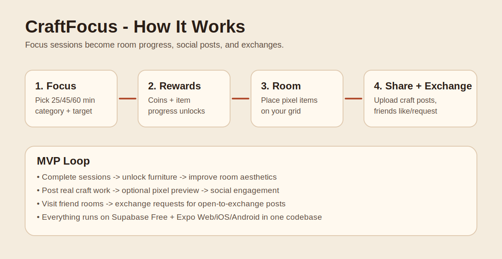
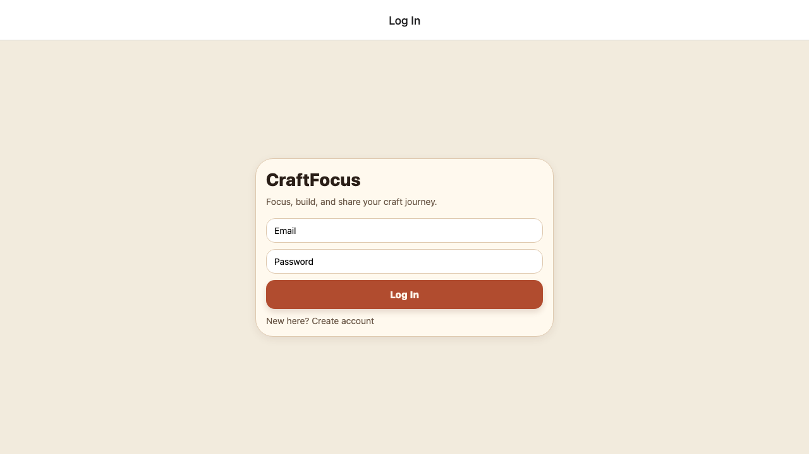
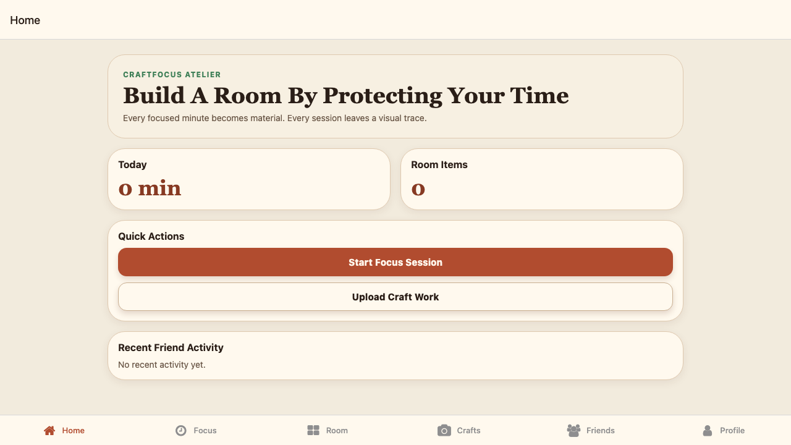
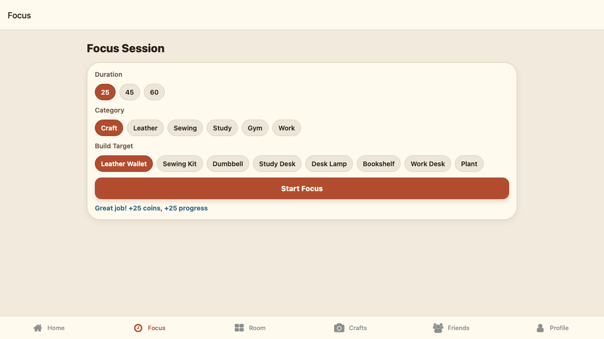
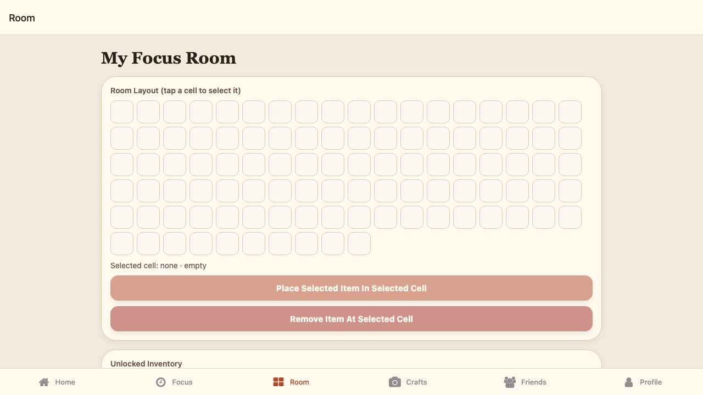
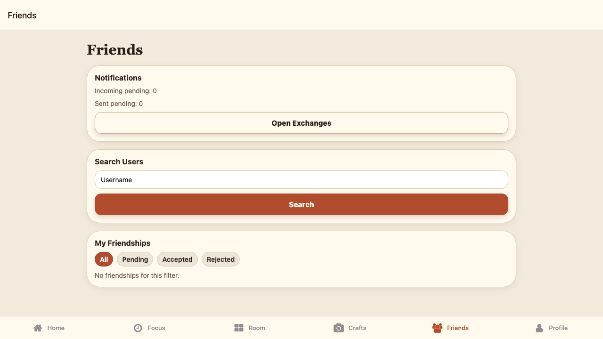
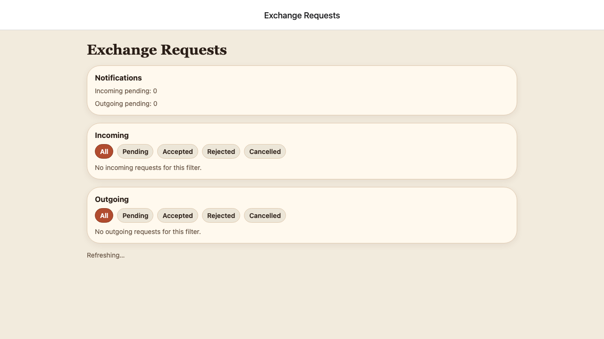

# CraftFocus

[](https://github.com/LEO0331/craftfocus/actions/workflows/deploy-pages.yml) [](https://github.com/LEO0331/craftfocus/actions/workflows/lighthouse.yml) [](./coverage)

CraftFocus is a focus-and-social app where deep work becomes seeds, room decorations, and collectible craft rewards.

Runs from one codebase on **iOS / Android / Web**.



## What You Can Do

- Run focus sessions (`25 / 45 / 60`) and earn seeds
- Build a personal pixel room and place inventory items
- Place custom claimed collectibles in a 5×5 gallery board
- Switch room themes (`Bedroom` / `Gym`)
- Upload custom craft listings and claim with seeds
- Keep custom claimed works as collectibles
- Like/comment for social interaction
- Unlock and set active animal companions

## How It Works

1. Sign up and log in.
2. Start a session; companion activity is auto-randomized (`sewing` or `training`).
3. Rewards: complete `25 -> 25`, `45 -> 50`, `60 -> 75`; stop -> `5` seeds.
4. Spend seeds on listings, place earned catalog items in your room.
5. Unlock more companions as completed focus minutes grow.

## For Players

CraftFocus is designed to feel quick, calm, and rewarding:
- Focus -> earn seeds
- Claim -> grow room
- Decorate -> express style
- Share -> interact socially

### Quick Tour

| Login | Home |
|---|---|
|  |  |

| Focus Complete | Room |
|---|---|
|  |  |

| Craft Listing Detail | Friends |
|---|---|
|  |  |

| Exchanges |
|---|
|  |

## Product Notes

- MVP is low-cost (Supabase free-tier friendly)
- No payments, full chat, or expensive AI generation
- Pixel preview generation is local/browser-first and lightweight

## V2 Canonical Model

CraftFocus V2 uses these canonical gameplay tables:
- `user_wallets` (seed balance)
- `user_inventory` (official placeable items)
- `listing_claims` (claimed listings)
- `custom_collectibles` (claimed custom works)
- `custom_gallery_placements` (5×5 collectible gallery placements)

Legacy tables like `user_items`, `room_items`, and `exchange_requests` are retained for backward compatibility but no longer drive core V2 UI flows.

## Quick Start

### 1) Install

```bash
npm install
```

### 2) Environment Variables

Create `.env`:

```bash
EXPO_PUBLIC_SUPABASE_URL=your_supabase_project_url
EXPO_PUBLIC_SUPABASE_ANON_KEY=your_supabase_anon_key
```

### 3) Run

```bash
npx expo start
npx expo start --web
# optional
npx expo start --ios
npx expo start --android
```

## Supabase Setup

### Apply migrations

```bash
supabase db push
```

### Seed item catalog

Use Supabase SQL Editor or CLI query:

```sql
-- paste file contents of:
-- supabase/seed_item_catalog.sql
```

### Optional V2 showcase seed

```sql
-- edit demo_user_id inside:
-- supabase/seed_v2_showcase.sql
```

### Required settings

- Enable Email/Password in Supabase Auth Providers
- Add site URLs and redirect URLs for local + production domains

## Storage Policy

Current default (social-feed compatible):
- Bucket: `craft-images` (`public-read`)
- Read: public (feed/profile rendering)
- Write/update/delete: authenticated owner prefix only (`<auth.uid()>/...`)
- Upload constraints: max `10MB`, MIME allowlist (`jpeg/png/webp`), signature validation

## Testing

### Unit

```bash
npm test
npm run test:coverage
```

### E2E (Web)

```bash
E2E_EMAIL=you@example.com
E2E_PASSWORD=your_password
npm run test:e2e
```

(Tests skip automatically if E2E env vars are missing.)

## Deployment

Web deployment uses GitHub Pages via GitHub Actions. Live URL pattern:
- `https://<github-username>.github.io/craftfocus/`

## Privacy & Security

- Never commit private credentials
- Use env vars and GitHub Secrets for runtime config
- Keep Supabase service-role keys out of frontend code

## License

See [LICENSE](./LICENSE).
