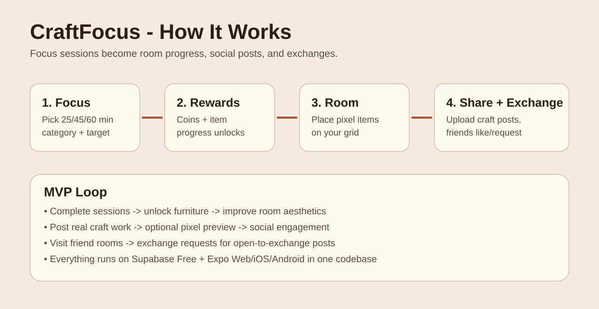
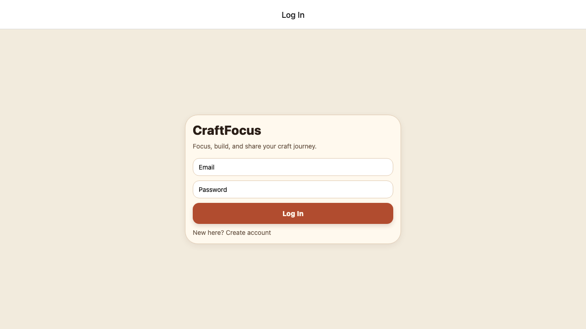
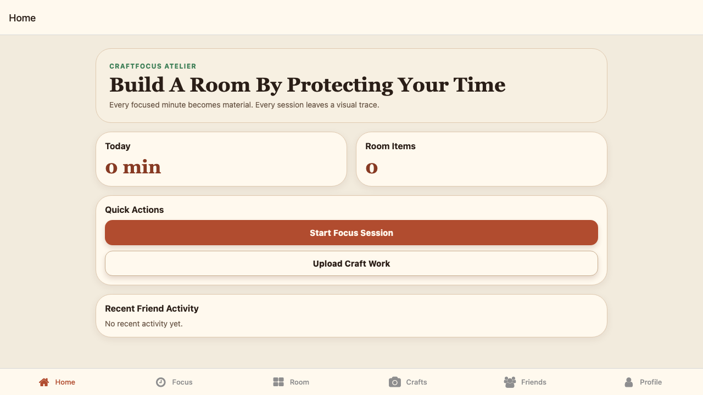
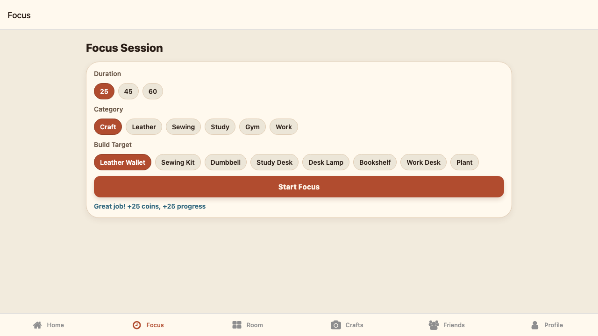
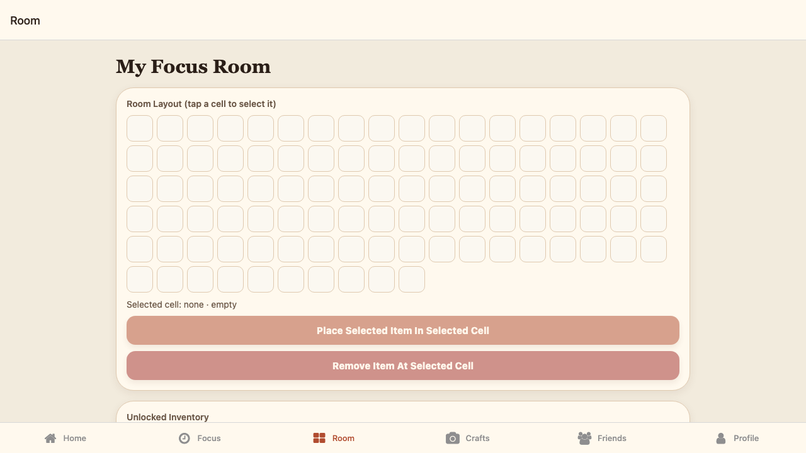
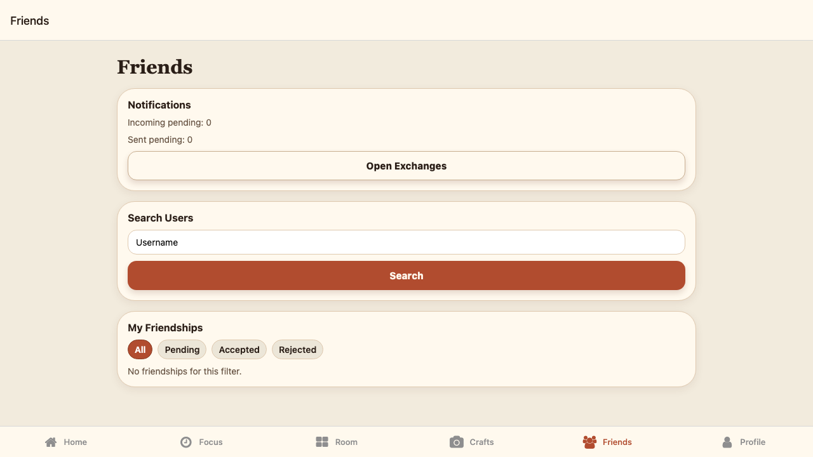
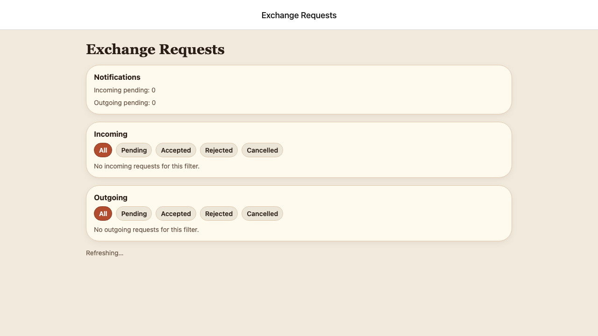

# CraftFocus

  

CraftFocus is a cozy focus-and-social craft app where protected time becomes seeds, room decorations, custom collectibles, and friend-room visits.

One Expo React Native + TypeScript codebase runs on **iOS, Android, and Web**.



## For Players

CraftFocus is built around a simple loop:

1. Start a focus session.
2. Stay in the focus view until the timer ends.
3. Earn seeds.
4. Claim official room items or player-made pixel crafts.
5. Decorate your room and collectible gallery.
6. Visit friends and interact with their crafts.

The login screen includes a lightweight animated preview of this loop so new players can understand the game before signing in.

## What You Can Do

- Run `25 / 45 / 60` minute focus sessions and earn seeds.
- Auto-stop focus if the user leaves the focus screen, browser tab, or app foreground.
- Claim official inventory items with seeds.
- Upload custom craft listings with generated pixel previews.
- Claim custom craft listings and place them in a 5x5 collectible gallery.
- Decorate a 2.5D room using predefined placement anchors.
- Switch room themes between `Bedroom` and `Gym`.
- Like, comment, add friends, and visit public friend rooms.
- Unlock animal companions and choose the active companion from Profile.
- Track official and custom claim history in **My Claims**.

## Quick Tour

| Login | Home |
|---|---|
|  |  |

| Focus Complete | Room |
|---|---|
|  |  |

| Friends | My Claims |
|---|---|
|  |  |

## Product Scope

Included:

- Supabase email/password auth
- Supabase Postgres, RLS, RPC, and Storage
- Seed wallet economy
- Focus timer and rewards
- Official inventory exchange
- Custom craft listing and claim flow
- Pixel preview abstraction and palette/grid fallback renderer
- Room placement and collectible gallery
- PWA installability for web users
- i18n for English and Traditional Chinese

Intentionally excluded from MVP:

- Real-money marketplace
- Stripe/payments
- Full chat
- Realtime multiplayer
- Video uploads
- Expensive AI image generation
- Offline Supabase data sync

## Current Gameplay Rules

- Completed `25` minute focus session: `25` seeds.
- Completed `45` minute focus session: `50` seeds.
- Completed `60` minute focus session: `75` seeds.
- Manual stop or visibility auto-stop after at least one minute: `5` seeds; shorter sessions earn `0`.
- Focus sessions auto-stop immediately when the focus view is left.
- Creating custom craft listings does **not** cost seeds.
- Custom craft publishing is limited to `10` new listings per user per day.
- Custom craft title limit: `20` characters.
- Custom craft description limit: `60` characters.
- Custom craft seed cost range: `1-100`.

## V2 Canonical Model

CraftFocus V2 uses these canonical gameplay tables:

- `profiles`
- `user_wallets`
- `focus_sessions`
- `animal_catalog`
- `user_animals`
- `item_catalog`
- `user_inventory`
- `rooms`
- `room_placements`
- `craft_posts`
- `listing_claims`
- `custom_collectibles`
- `custom_gallery_placements`
- `likes`
- `comments`
- `friendships`

Legacy tables such as `user_items`, `room_items`, and `exchange_requests` are retained for safe backward compatibility but no longer drive the main V2 UI flows.

## Architecture

- **Frontend:** Expo React Native, TypeScript, Expo Router, React Native Web.
- **State:** Lightweight hooks/context with Supabase as source of truth.
- **Backend:** Supabase Auth, Postgres, Storage, RLS, and RPC.
- **Web hosting:** GitHub Pages static export under `/craftfocus`.
- **PWA:** Static shell caching only; no offline write sync.
- **Images:** Supabase Storage for uploaded craft images; local/browser pixel conversion where supported; palette/grid fallback renderer for custom pixel display.

More detail:

- [Architecture Deep Dive (English)](./docs/ARCHITECTURE_DEEP_DIVE_EN.md)
- [架構深度解析（繁體中文）](./docs/ARCHITECTURE_DEEP_DIVE_ZH-TW.md)
- [API Design Review](./docs/API_DESIGN_REVIEW.md)
- [E2E Test Report](./docs/E2E_REPORT.md)

## Quick Start

### 1) Install

```bash
npm install
```

### 2) Configure Environment

Create `.env`:

```bash
EXPO_PUBLIC_SUPABASE_URL=your_supabase_project_url
EXPO_PUBLIC_SUPABASE_ANON_KEY=your_supabase_anon_key
```

Only use the public anon key in frontend code. Never commit service-role keys.

### 3) Run Locally

```bash
npx expo start
npx expo start --web
npx expo start --ios
npx expo start --android
```

## Supabase Setup

### Apply migrations

```bash
supabase db push
```

If Supabase reports local migrations that should be inserted before the remote latest migration, review the migration history and run:

```bash
supabase db push --include-all
```

Only do this when those migration files are expected for the linked project.

### Seed official items

Use the Supabase SQL Editor or CLI query to run:

```sql
-- paste the contents of supabase/seed_item_catalog.sql
```

### Optional demo/showcase seeds

Use only for development/demo projects:

```sql
-- edit demo_user_id inside supabase/seed_v2_showcase.sql first
-- then run the file contents in Supabase SQL Editor
```

### Required Auth Settings

In Supabase Dashboard:

- Enable Email/Password provider.
- Add local redirect URL, for example `http://localhost:8081` or your Expo dev URL.
- Add production site URL: `https://<github-username>.github.io/craftfocus/`.
- Add production redirect URL: `https://<github-username>.github.io/craftfocus/`.

## Storage Policy

Current default for social feed images:

- Bucket: `craft-images`.
- Read: public, so feed/profile images can render without signed URLs.
- Write/update/delete: authenticated owner prefix only (`<auth.uid()>/...`).
- Upload constraints: max `10MB`, MIME allowlist (`jpeg/png/webp`), signature validation.

## Testing

### Unit and Coverage

```bash
npm test
npm run test:coverage
```

### Web E2E

```bash
npm run e2e:build
npm run test:e2e
```

Credential-gated E2E specs skip automatically when credentials are not provided.

To run authenticated E2E against a deployed app:

```bash
E2E_BASE_URL=https://<github-username>.github.io/craftfocus \
E2E_EMAIL=you@example.com \
E2E_PASSWORD=your_password \
npm run test:e2e
```

### Lighthouse

```bash
npm run lighthouse:web
```

The Lighthouse workflow is useful for checking performance, accessibility, best-practices, and SEO on the static web export.

## Deployment

Web deployment uses GitHub Pages via GitHub Actions.

Expected public URL:

```text
https://<github-username>.github.io/craftfocus/
```

Required GitHub repository secrets:

```text
EXPO_PUBLIC_SUPABASE_URL
EXPO_PUBLIC_SUPABASE_ANON_KEY
```

The deploy workflow injects these at build time for the static Expo web export.

## PWA Support

CraftFocus web is installable as a secondary channel:

- `manifest.webmanifest` provides install metadata.
- `service-worker.js` caches the static shell and assets.
- Browser-native install prompts are used; there is no custom install modal.

Offline behavior:

- Previously loaded static shell/routes can open offline.
- Supabase-backed actions still require network, including login, wallet updates, claims, uploads, comments, and friend actions.

Install paths:

- Chrome/Edge desktop or Android: use the browser install action.
- Safari iOS: Share -> Add to Home Screen.

## Privacy & Security

- Do not commit private credentials, service-role keys, personal test passwords, or Supabase `.temp` metadata.
- Use `.env` locally and GitHub Secrets in CI/deployment.
- Frontend code should only receive `EXPO_PUBLIC_*` public values.
- RLS and RPC functions enforce the important data boundaries; keep migrations reviewed.

## License

See [LICENSE](./LICENSE).
