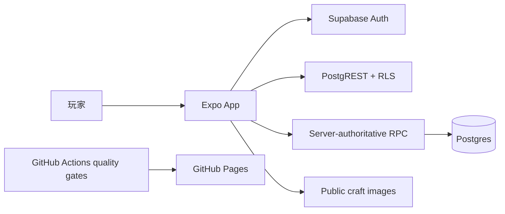

# CraftFocus 深度驗收審查摘要

審查日期：2026-09-15  
審查範圍：完整 repository、Supabase schema/RLS/RPC、Storage、CI/CD、測試與維運文件

## 審查結論

CraftFocus 已完成一輪以實際程式碼與可重複測試為基礎的深度驗收。審查中確認的兩項 HIGH 風險——公開 feed 的無上限 engagement 讀取，以及前端部署缺少品質與遠端 schema gate——均已修正。

修正後的 GitHub Actions deployment #88 已成功完成 quality 與 deploy jobs，並發布至 [CraftFocus GitHub Pages](https://leo0331.github.io/craftfocus/)。目前程式碼未發現已知 BLOCKER；核心經濟操作由 server-authoritative RPC、RLS、database constraints 與 transaction 保護。

## 系統與信任邊界

CraftFocus 是以 Expo React Native、TypeScript 與 Expo Router 建立的跨平台專注與社交創作 App，使用 Supabase Auth、Postgres、Storage、RLS 和 RPC 作為後端，Web 版本部署於 GitHub Pages。

公開創作圖片允許任何人讀取，符合社交展示需求；寫入、更新與刪除僅允許通過 owner-prefixed Storage policy 的已登入擁有者。

## 已驗證的核心控制

| 領域 | 驗證結果 |
|---|---|
| Authentication | Supabase session；Web 使用 local storage，native 使用 SecureStore |
| Focus rewards | Server-issued session ID、server clock、advisory lock、idempotent completion |
| Seed claims | 扣款、claim record 與 inventory/collectible grant 位於同一 transaction |
| Room placement | Owner check、room lock、替換退款與 single-refund removal |
| Public content | Title/description/comment database length constraints；每帳號每 UTC 小時 100 則留言 quota |
| Feed scalability | Engagement totals 使用最多 100 個 post IDs 的 bounded aggregate RPC，不下載全部 comments |
| Storage | 10 MB、JPEG/PNG/WebP、owner prefix write/delete policy、public read |
| Deployment | Typecheck、unit/browser、fresh migrations、database regression/concurrency、remote schema contract gate |

## 驗證證據

- TypeScript：通過。
- Unit tests：21 files、73 tests 全數通過。
- Browser smoke：3 tests 通過；2 個需要帳號的 authenticated E2E tests 依設計跳過。
- Fresh PostgreSQL migrations、database regressions 與 concurrency tests：GitHub Actions quality job 通過。
- Production dependency audit：0 vulnerabilities。
- Supabase deployment contract：通過；遠端 migration 缺失時會阻擋發布。
- GitHub Pages deployment #88：quality 與 deploy jobs 成功。

## 審查後完成的改善

1. 將 feed 的 like/comment 計數改為 bounded server aggregation。
2. 在資料庫層限制公開 UGC 長度與每小時留言量，避免繞過 client validation。
3. 將 TypeScript、unit、browser、migration、regression 與 concurrency checks 納入部署 gate。
4. 加入遠端 schema contract version，避免 frontend 與 Supabase RPC/schema 不相容時發布。
5. 將 migration 設計為可安全重跑，支援 SQL Editor recovery 與後續 `supabase db push`。

## 仍需持續管理的項目

- 完整 authenticated E2E 需要受控測試帳號與 credentials；未提供時會明確跳過，不列為已驗證。
- Production monitoring、alerting、backup/restore 與 rollback drill 屬於 Supabase/GitHub 環境治理，repository 本身無法證明其實際設定。
- 使用 Supabase 內建測試寄信服務期間，email confirmation 暫時停用；正式營運應配置 production SMTP 後重新評估。
- GitHub Actions 顯示部分官方 actions 的 Node.js 20 runtime deprecation warning；目前 runner 已強制使用 Node.js 24，未阻擋 quality 或部署。

## 可信度說明

本摘要代表「目前 repository 與列出的驗證證據」所支持的結論，不是永續安全保證。可信度來自可追溯的 migrations、權限規則、自動化測試、release gates 與成功 deployment，而不是單純的功能宣稱。

更多技術證據：

- [Architecture Deep Dive](./ARCHITECTURE_DEEP_DIVE_EN.md)
- [架構深度解析（繁體中文）](./ARCHITECTURE_DEEP_DIVE_ZH-TW.md)
- [Backend Review](./PROJECT_REVIEW_BACKEND.md)
- [API Design Review](./API_DESIGN_REVIEW.md)
- [E2E Test Report](./E2E_REPORT.md)
- [Supabase Deployment Recovery](./SUPABASE_DEPLOYMENT_RECOVERY.md)
